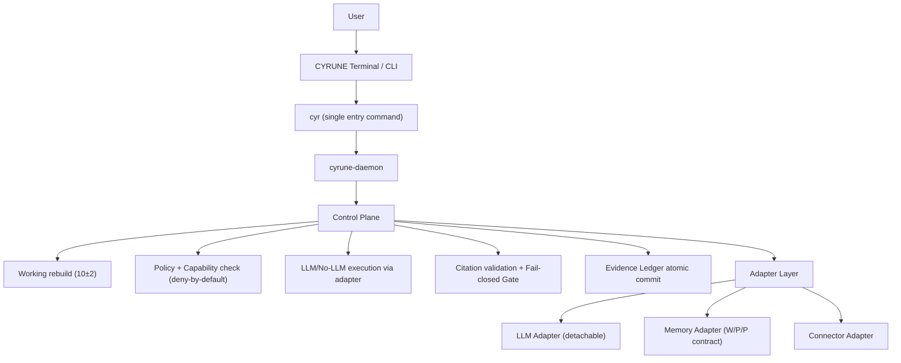
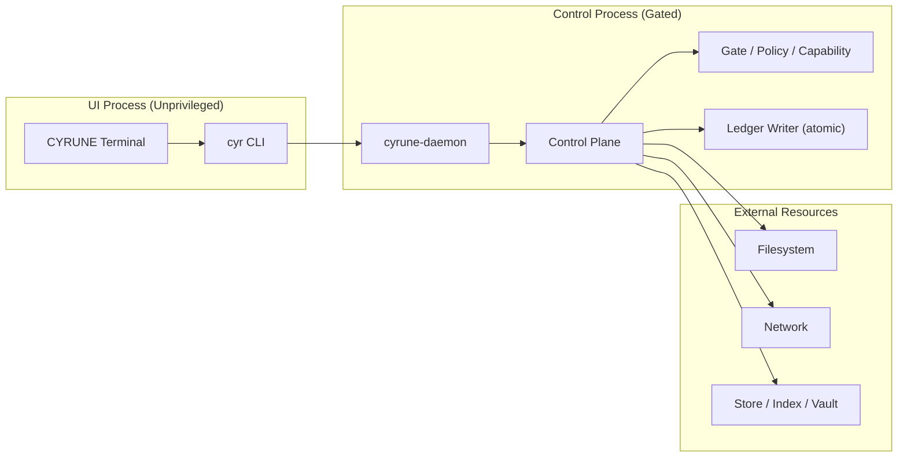
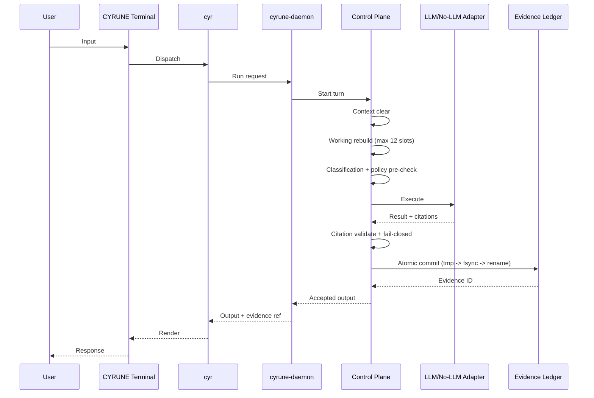

# CYRUNE Free v0.1 Structure Pack

**状態（当時）**: Historical explanatory structure pack
**現在の権威状態**: Historical / non-authoritative
**取り扱い**: 2026-04-12 JST の `PB-C / PBC-I1 authority-state segregation` 後、この文書は current accepted source ではない。Free v0.1 の初期構造整理として参照に限定する。現行 authority は `docs/current/CYRUNE-Free_Canonical.md`、`free/v0.1/dev-docs/03-architecture/ARCHITECTURE_OVERVIEW.md`、`free/v0.1/dev-docs/summary/02-ARCHITECTURE_AND_RUNTIME_LINES.md` である。

## 1. Logical Architecture



## 2. Process Boundary



## 3. 1-Turn Execution Flow



## 4. Runtime Data Layout (`~/.cyrune`)

```text
~/.cyrune/
├─ terminal/
│  └─ config/
│     └─ wezterm.lua
├─ ledger/
│  ├─ manifests/
│  │  └─ index.jsonl
│  └─ evidence/
│     └─ EVID-<id>/
│        ├─ manifest.json
│        ├─ run.json
│        ├─ policy.json
│        ├─ stdout.log
│        ├─ stderr.log
│        └─ hashes.json
├─ working/
│  └─ working.json
├─ packs/
│  └─ policy/
│     └─ default/
└─ cache/
```

## 5. Repository Layout (v0.1 Minimal)

```text
cyrune/
├─ crates/
│  ├─ cyr/
│  ├─ cyrune-daemon/
│  ├─ cyrune-core/
│  ├─ cyrune-control-plane/
│  ├─ cyrune-policy/
│  ├─ cyrune-ledger/
│  ├─ cyrune-adapter/
│  ├─ cyrune-view/
│  └─ cyrune-pack/
├─ apps/
│  └─ terminal/
├─ packs/
│  └─ policy/
│     └─ default/
├─ docs/
│  ├─ canonical/
│  └─ adr/
└─ xtask/
```
