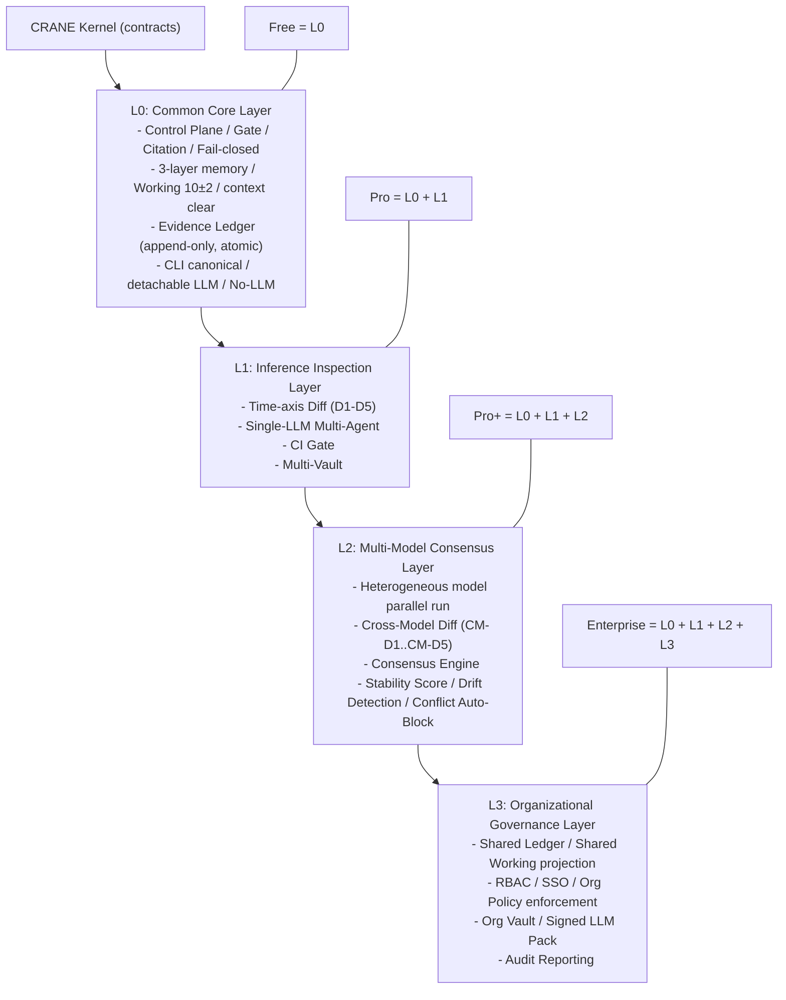
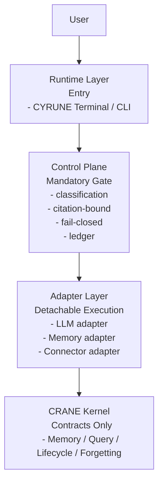

# CYRUNE 全体構造（論理レイヤ図）

**状態（当時）**: Historical tier and positioning sketch
**現在の権威状態**: Historical / non-authoritative
**取り扱い**: 2026-04-12 JST の `PB-C / PBC-I1 authority-state segregation` 後、この文書は current accepted source ではない。ティア積層と製品ポジショニングの初期整理として参照に限定する。現行 authority は `docs/deferred/CYRUNE_ProductTierCanonical.md`、`docs/current/CYRUNE-Free_Canonical.md`、`free/v0.1/dev-docs/summary/01-SYSTEM_AND_SCOPE.md` である。

---

# ティア積層構造（Free基盤 + 差分追加）

この文書では、CYRUNEを以下の順で積み上げる構造として扱う。

1. ベースとなる `CYRUNE Free`
2. `Free` に差分追加した `CYRUNE Pro`
3. `Pro` に差分追加した `CYRUNE Pro+`
4. `Pro+` に差分追加した `CYRUNE Enterprise`

## Tier Stack



## Layer x Tier 追加マトリクス

| Layer | Free | Pro | Pro+ | Enterprise | そのLayerが初めて追加されるTier |
|---|---|---|---|---|---|
| L0: Common Core | Active | Inherited | Inherited | Inherited | Free |
| L1: Inference Inspection | - | Active | Inherited | Inherited | Pro |
| L2: Multi-Model Consensus | - | - | Active | Inherited | Pro+ |
| L3: Organizational Governance | - | - | - | Active | Enterprise |

## 1) ベース: CYRUNE Free

Freeは機能削減版ではなく、制御OSとしての最小完成形。

共通コア（全ティアで維持）:

* 3層メモリ（Working / Processing / Permanent）
* Working 10±2
* context clear per turn
* Fail-closed Gate
* Citation-bound reasoning
* Evidence Ledger（append-only, atomic）
* Detachable LLM / No-LLM mode
* CLI canonical

## 2) 差分追加: CYRUNE Pro = Free + delta(Pro)

Pro差分（追加されるもの）:

* 推論差分（時間軸 D1-D5）
* Single-LLM Multi-Agent（Planner / Critic / Verifier / Synthesizer）
* CI Gate
* Multi-Vault

## 3) 差分追加: CYRUNE Pro+ = Pro + delta(Pro+)

Pro+差分（追加されるもの）:

* 異種LLM並列実行（run_group）
* Cross-Model Diff（CM-D1-D5）
* Consensus Engine
* Stability Score
* Conflict Auto-Block
* Model Drift Detection

## 4) 差分追加: CYRUNE Enterprise = Pro+ + delta(Enterprise)

Enterprise差分（追加されるもの）:

* 共有Ledger
* 共有Working projection
* RBAC
* SSO
* 組織Policy強制
* 組織Vault分離
* LLMパック署名管理
* 監査レポート出力

## 実装境界（この文書における前提）

* Control Planeの本質はFreeコアで固定する
* 上位ティア差分はFreeコアを削らずに追加する
* Adapter/Policy/Runtimeは差し替え可能だが、実行は必ずControl Planeを通す

---

## 基盤レイヤ構図（責務と通過順）



```text
┌──────────────┐
│     User     │
└──────┬───────┘
       │
       ▼
┌──────────────────────────────────────────────┐
│ Runtime Layer                                │
│ Entry: CYRUNE Terminal / CLI                 │
└──────┬───────────────────────────────────────┘
       │
       ▼
┌──────────────────────────────────────────────┐
│ Control Plane                                │
│ Mandatory Gate:                              │
│ - classification                             │
│ - citation-bound                             │
│ - fail-closed                                │
│ - ledger                                     │
└──────┬───────────────────────────────────────┘
       │
       ▼
┌──────────────────────────────────────────────┐
│ Adapter Layer                                │
│ Detachable Execution:                        │
│ - LLM adapter                                │
│ - Memory adapter                             │
│ - Connector adapter                          │
└──────┬───────────────────────────────────────┘
       │
       ▼
┌──────────────────────────────────────────────┐
│ CRANE Kernel                                 │
│ Contracts Only:                              │
│ - Memory / Query / Lifecycle / Forgetting    │
└──────────────────────────────────────────────┘
```

| Layer | 主責務 | 境界ルール |
|---|---|---|
| Runtime | ユーザー入口・コマンド受付 | 実行は必ずControl Planeに委譲 |
| Control Plane | 検証・強制・証跡確定 | fail-open禁止、未検証出力禁止 |
| Adapter | 実装差し替えと外部実行 | 直接実行禁止、Control Plane経由のみ |
| CRANE Kernel | 契約定義（抽象） | 実装ロジックを持たない |

---

#  重要な境界

### Kernel

* 契約のみ
* 実装なし
* ドメイン非依存
* ドメイン最適化ロジックや実装依存の振る舞いを含まない

### Adapter

* 実装はここ
* 差し替え可能
* detachable intelligence

### Control Plane

* CYRUNEの本体
* ここが価値
* Gate + Ledger

### Runtime

* ユーザーが触れる唯一の入口

---

# ユーザー視点図（体験構造）

```
User
  ↓
CYRUNE Terminal
  ↓
AI Agent (claude code / codex)
  ↓
(必ず Control Plane を通過)
  ↓
Memory / Connector
```

AIは直接アクセスできない。
必ず Gate を通る。

---

# データフロー図（1ターンの流れ）

```
1. User input
2. Terminal receives
3. Context cleared
4. Working reconstructed from Processing
5. Mandatory classification
6. Policy check
7. LLM call (adapter)
8. Citation validation
9. Fail-closed verification
10. Ledger write
11. Output to user
```

LLMは7番目にしか出てこない。

---

# 🏗 最小v0.1構成図

```
Terminal
  └─ Control Plane (minimal)
        ├─ LLM adapter (Claude only)
        ├─ In-memory store
        └─ Ledger (JSON append)
```

---

#  本質

CYRUNEは：

* LLMラッパーではない
* メモリ管理ツールでもない
* IDEでもない

CYRUNEは：

> AI実行前に必ず通る強制境界層

---

# 物理構成図（Rust crate分割図）

## A. v0.1（単一バイナリでも成立する分割）

```
cyrune/
├─ crates/
│  ├─ cyrune-kernel/                # (薄い) OS中核の抽象: 型・状態・契約
│  │   ├─ classification.rs         # Mandatory classification の型
│  │   ├─ policy.rs                 # Policy decision (allow/deny/require-proof)
│  │   ├─ evidence.rs               # Evidence requirement の型
│  │   ├─ capability.rs             # deny-by-default capability set
│  │   └─ ledger.rs                 # Ledger record schema (WORM志向)
│  │
│  ├─ cyrune-control-plane/         # 実装本体: Gate + Ledger + orchestration
│  │   ├─ gate/
│  │   │   ├─ preflight.rs          # turn開始: context-clear / working再構築
│  │   │   ├─ policy_gate.rs        # policy pack 適用
│  │   │   ├─ citation_gate.rs      # citation-bound enforcement
│  │   │   ├─ failclosed_gate.rs    # fail-closed validation
│  │   │   └─ postflight.rs         # ledger write / promote-demote
│  │   ├─ runtime_api.rs            # runtime(terminal)に公開するAPI
│  │   └─ orchestration.rs          # adapter呼び出し順序・例外を閉じる
│  │
│  ├─ cyrune-runtime-cli/           # Terminal entry / command dispatcher
│  │   ├─ main.rs                   # CLI entry
│  │   ├─ tui.rs                    # terminal UI（最小）
│  │   ├─ commands/                 # subcommands
│  │   └─ session.rs                # 1-turn session driver
│  │
│  ├─ cyrune-editor/                # 超軽量TextEditor（別binでもOK）
│  │   ├─ buffer.rs
│  │   ├─ view.rs
│  │   └─ fileio.rs
│  │
│  ├─ cyrune-adapter-llm/           # detachable intelligence
│  │   ├─ trait.rs                  # LlmAdapter trait (domain non-specific)
│  │   ├─ claude_code.rs
│  │   ├─ codex_cli.rs
│  │   └─ local_stub.rs
│  │
│  ├─ cyrune-adapter-memory/        # 3層メモリ実装（kernel契約の実体側）
│  │   ├─ store_working_inmem.rs
│  │   ├─ store_processing_sqlite.rs
│  │   ├─ store_permanent_sqlite.rs
│  │   ├─ index_hybrid.rs           # (v0.1は簡易で良い)
│  │   └─ embed_null.rs             # まずnull/cheap
│  │
│  ├─ cyrune-adapter-connector/     # 外部I/O (FS/Git/CI…) deny-by-default
│  │   ├─ fs.rs
│  │   ├─ git.rs
│  │   └─ ci.rs
│  │
│  ├─ cyrune-policy-pack/           # Consumer/Medical/Finance/Custom
│  │   ├─ consumer.rs
│  │   ├─ medical.rs
│  │   ├─ finance.rs
│  │   └─ custom.rs
│  │
│  └─ cyrune-telemetry/             # 観測（SLO/メトリクス）※後回し可
│      └─ events.rs
│
└─ bins/
   ├─ cyrune                         # terminal app
   └─ cyrune-editor                  # optional
```

### この分割の狙い（重要な境界）

* **cyrune-kernel**：型/契約だけ（依存を最小にして凍結しやすくする）
* **cyrune-control-plane**：価値の塊（GateとLedgerの決定性・閉集合・fail-closed）
* **adapter-***：差し替え可能（LLMもメモリもコネクタも “実装” はここ）
* **runtime-cli**：ユーザーが触る入口（でも権限は持たない）

> ここでの「kernel」は CRANE-Kernel と名前が衝突するので、実repoでは `cyrune-core-contract` みたいに改名するのが安全。
> ただし図の意図は「薄い契約層」を示す。

---

## B. もう一段硬くする（CITADEL寄りを見据えた分割）

v0.2+で “プロセス分離” を入れるなら、crateもそれに合わせて分割しておくと楽。

```
cyrune/
├─ crates/
│  ├─ cyrune-control-plane/        # ここは不変
│  ├─ cyrune-runtime-cli/          # UI/CLI
│  ├─ cyrune-daemon-proto/         # IPC schema (capabilities, requests, ledger)
│  ├─ cyrune-daemon/               # control-plane を別プロセスで動かす
│  ├─ cyrune-adapter-*/            # ここはdaemon側に寄せる
│  └─ cyrune-editor/
└─ bins/
   ├─ cyrune
   └─ cyrune-daemon
```

---

# プロセス境界図

## 1) v0.1（単一プロセス：まず勝てる最小）

```
┌───────────────────────────────────────────────┐
│                 cyrune (single process)       │
│                                               │
│  [Terminal UI / CLI]                          │
│        │                                      │
│        ▼                                      │
│  [Control Plane]  Gate / Ledger / Policy      │
│        │                                      │
│        ▼                                      │
│  [Adapters] LLM / Memory / Connector          │
│        │                                      │
│        ▼                                      │
│  OS resources: filesystem / git / network     │
└───────────────────────────────────────────────┘
```

### v0.1で「境界」を壊さない条件

* OSアクセスは **必ずControl Plane経由で**（コード規約・モジュール境界で強制）
* “deny-by-default capability set” は **実行経路を閉じる**（例：Connector adapterを経由しないAPIは禁止）
* Ledgerは同一プロセスでも **append-only** 前提でフォーマットを固定

---

## 2) v0.2+（二プロセス：Control Planeを「権限分離」する）

ここからが「OSっぽさ」が出ます。TerminalはUIだけになり、権限はdaemon側へ。

```
                  (unprivileged)
┌───────────────────────────────────────────────┐
│             cyrune (Terminal UI)              │
│  - input / view / editor launch               │
│  - no direct adapters                          │
└───────────────────────────────────────────────┘
                │   IPC (uds/grpc/quic)
                ▼
                  (privileged / gated)
┌───────────────────────────────────────────────┐
│               cyrune-daemon                   │
│  [Control Plane]                              │
│   - Mandatory classification                  │
│   - Policy pack enforcement                   │
│   - Fail-closed gate                          │
│   - Citation-bound enforcement                │
│   - Evidence ledger (WORM-ish)                │
│                                               │
│  [Adapters]                                    │
│   - LLM adapter (codex/claude/local)          │
│   - Memory adapter (store/index/embed)        │
│   - Connector adapter (fs/git/ci/browser)     │
└───────────────────────────────────────────────┘
                │
                ▼
┌───────────────────────────────────────────────┐
│ OS resources / Network / Filesystem / Git     │
└───────────────────────────────────────────────┘
```

### この分離で得られるもの

* Terminalが侵害されても、**Gateをバイパスできない**
* Adapter実行がdaemon側に閉じるので、**権限と証跡を一箇所に固定**できる
* “deny-by-default” の enforcement が物理化する

---

## 3) v0.3+（三プロセス：LLM実行すらサンドボックス化）

LLM呼び出し自体を “外部アダプタ” として完全に隔離したい場合。

```
┌───────────────┐
│ Terminal UI   │  (unprivileged)
└───────┬───────┘
        │ IPC
        ▼
┌───────────────────────────────────────────────┐
│ cyrune-daemon (control-plane, privileged)     │
│ - gate/ledger/policy                          │
│ - memory/connector adapters                   │
└───────┬───────────────────────────────────────┘
        │ constrained IPC (capability token)
        ▼
┌───────────────────────────────────────────────┐
│ llm-runner (replaceable adapter process)      │
│ - codex / claude-code / local                 │
│ - no filesystem (or read-only)                │
│ - bounded network                             │
└───────────────────────────────────────────────┘
```

ここまで行くと “Detachable intelligence” がプロセス境界で確定。
